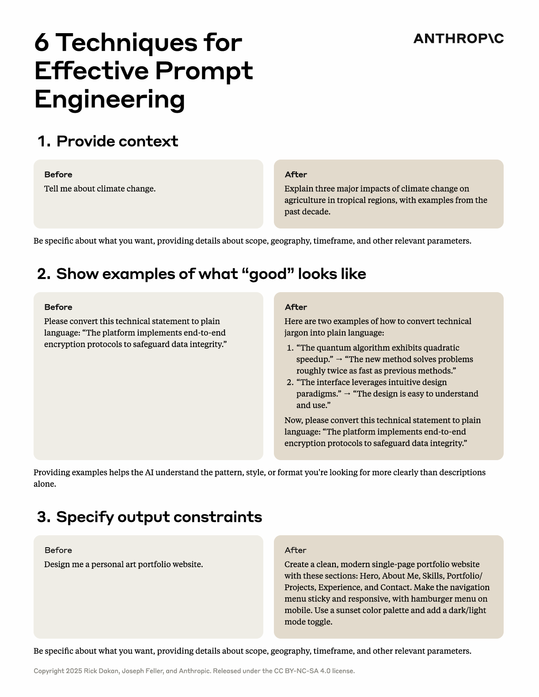
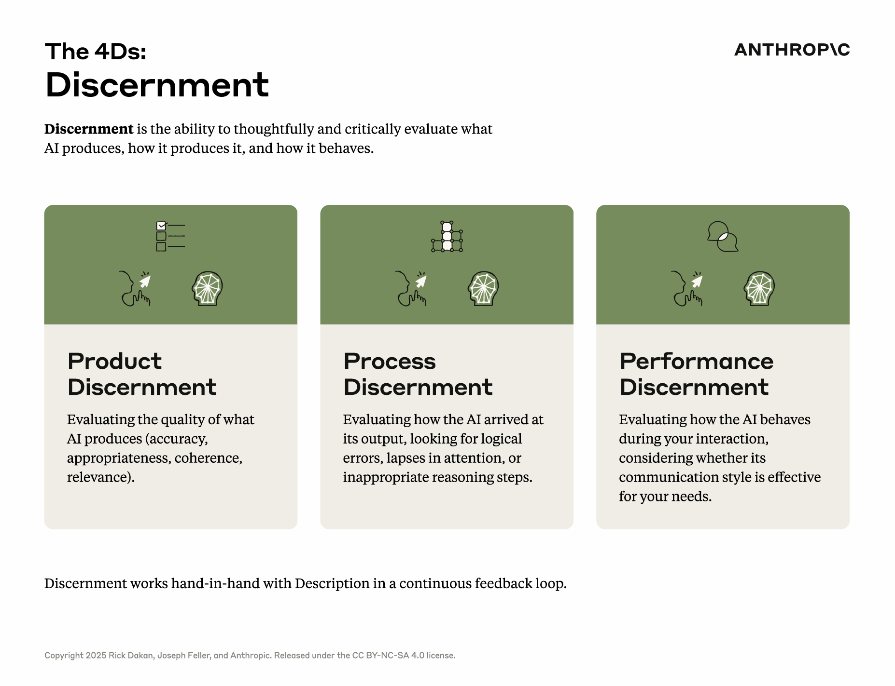
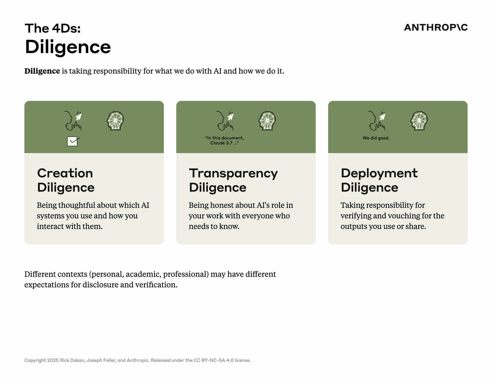

# AnthropicAI素养课程 核心概念

## Framework

AI素养的核心是能够高效、有效、安全且合乎道德地与AI系统互动
AI素养框架围绕"4D"能力构建：
委派（Delegation）：任务委派合理分配人机分工
描述（Description）：需求描述——精准表达指令与需求
判别（Discernment）：准确评估AI输出与行为的有用性
尽职（Diligence）：对我们使用AI的方式和行为负责。

## Summary

## Delegation

委派 (Delegation)：明智地选择与AI协作的任务与方式
委派是AI素养的第一环，指的是用户经过深思熟虑，判断哪些工作任务适合交由AI处理或与AI协作完成，哪些部分仍需人类主导，并据此选择最合适的AI工具及协作模式。
这不仅仅是一个技术选择，更是一个策略性决策过程。
委派的核心在于“决定何时以及如何使用AI，并为任务选择正确的工具 (Deciding when and how to use AI, and choosing the right tools for the task)”。
我们需要:
理解在何种情况下、出于何种原因以及采用何种方式将特定任务委派给AI是合理的。
培养评估不同AI工具在特定任务上的适用性、优势与局限性的能力。
学会在具体任务中，如何恰当平衡人类与AI的角色和职责分配，以达到最佳协同效能。
认知到委派决策对后续协作效率、成果质量及潜在风险的影响。
关键考量因素
任务性质：任务的复杂性、创造性要求、重复性程度、对精确性的要求等。
能力匹配：个人或团队的既有技能与AI在该任务上的能力（如数据处理、模式识别、内容生成）是否匹配，能否形成互补。
成果预期：对任务成果的质量标准、创新性要求、以及完成时限。
效益与成本：使用AI可能带来的时间节省、成本降低或价值提升，相对于投入（学习成本、工具成本、风险成本）的权衡。
风险评估：AI处理任务可能存在的偏见、错误、安全漏洞或伦理问题，以及相应的应对策略。

## Description

描述 (Description)：精准地向AI传达意图与需求
描述是实现有效人机协作的关键沟通环节。它不仅指编写有效的提示词（prompts），更是一门与AI系统进行清晰、有目的沟通的艺术，旨在创造一个人类与AI能够高效协同工作的环境。核心在于确保AI准确理解用户的意图、需求、期望的输出形式以及协作过程中的行为方式。
我们需要
理解如何有效地向AI系统传达自己的意图和需求。
认识到在人机协作中，清晰、有目的的沟通至关重要。
发展在三个关键层面的描述技能：产品描述、过程描述和性能描述。
核心技能
清晰表达：用明确无歧义的语言阐述需求。
结构化指令：将复杂任务分解为更小、更易于AI理解的步骤。
提供上下文：给予AI足够的背景信息，帮助其更好地把握任务的核心。
迭代优化：根据AI的初步反馈，不断调整和完善描述，直至达到预期效果。
AI无法读取用户的思想，因此，人机协作成果的质量在很大程度上取决于用户能否清晰、全面地阐述其需求、偏好的处理方式以及期望的互动风格。
### prompt-engineering

6个有效提示词工程技巧
- 提供上下文
- 展示“好”的样例
- 指定输出约束
- 分解复杂任务
- 使用系统提示
- 迭代和优化

## Discernment

辨别 (Discernment)：批判性地评估AI的输出与过程
辨别是AI素养中与“描述”相辅相成的关键能力，它指的是用户审慎、批判性地评估AI所生成的输出内容、其达成输出所采用的过程以及在互动中的行为表现。如果说“描述”是向AI有效输入，那么“辨别”就是对AI的输出进行有效把关。
我们需要
理解如何以深思熟虑的方式评估AI的输出和执行过程。
发展在与AI互动过程中所需的批判性思维技能。
学习识别并有效处理在AI互动中可能出现的质量问题。
“辨别”能力的三个层面
产品辨别 (Product Discernment)：关注对AI实际输出成果的质量评估。这包括判断其准确性（是否包含事实错误或误导信息）、适当性（是否符合任务要求和伦理规范）、连贯性（逻辑是否清晰、行文是否流畅）和相关性（是否切题、是否有价值）。
过程辨别 (Process Discernment)：评估AI是如何达成其输出结果的。这涉及到审视AI在处理任务时是否存在逻辑错误、注意力偏差（如遗漏关键信息）、不恰当的推理方式或依赖了不可靠的数据源。
性能辨别 (Performance Discernment)：评估AI在与用户协作过程中的行为表现本身。这包括考量AI的沟通风格是否清晰、是否能有效响应用户指令和反馈、是否表现出“理解”用户的深层需求，以及其交互方式是否适合用户的特定需求和场景。
核心技能
事实核查：验证AI提供信息的准确性，尤其对于关键数据和论断。
逻辑分析：审视AI的推理过程是否合理，是否存在逻辑谬误。
识别偏见：警惕AI输出中可能存在的来自训练数据或算法本身的偏见。
评估创造性与原创性：对于创意类任务，判断AI生成内容的独特性和价值。
理解局限性：认识到AI当前的技术边界，不盲从其所有输出。
即使是最先进的人工智能系统，也离不开人类的判断和监督。辨别能力与描述能力在一个人机协作的持续反馈循环中紧密配合，共同提升协作质量。

## Diligence

尽职是“4D”框架中至关重要的一环，它关注的是在人机协作全过程中确保负责任性、透明度和问责制，尤其强调AI应用的伦理考量和安全保障。它要求用户对AI辅助生成或共同创造的内容和决策承担最终责任。尽职的核心是“承担所有权，保持透明，并确保AI生成的工作合乎道德、准确且适当 (Taking ownership, being transparent, and ensuring that AI-generated work is ethical, accurate, and appropriate)。”
我们需要
深刻理解在AI协作中人类承担最终责任的必要性和重要性。
学习如何系统性地检查和确保AI生成或辅助生成的内容在准确性、合乎道德以及场景适宜性方面达到标准。
培养识别和认知AI应用相关的潜在风险（如固有偏见、错误信息传播、隐私侵犯、恶意使用等）的能力，并主动采取规避或缓解措施。
掌握在工作中适当声明AI使用情况（透明度）的方法和原则。
关键实践
透明度 (Transparency)：在适当的时候清晰声明AI在工作成果中的参与程度和扮演角色，避免误导。
问责制 (Accountability)：人类用户对最终输出的成果（无论是文本、代码、设计还是决策建议）负有最终审查和确认的责任。
数据隐私与安全：在使用AI处理敏感数据时，严格遵守数据保护法规和伦理准则，确保数据安全。
避免有害应用：警惕并主动避免将AI技术用于可能导致歧视、散布虚假信息、侵犯人权或造成其他社会危害的场景。
持续学习与适应：由于AI技术和相关伦理规范在不断发展，保持学习心态，持续更新知识，适应新的挑战。
人类监督与干预：在AI决策或执行流程中设置必要的人类监督节点，确保在关键时刻可以进行人工干预和纠偏。
尽职的核心是将人类的核心价值观和严谨的道德考量置于AI设计、开发、部署和应用的全过程，确保技术的发展服务于人类福祉，而非带来潜在风险或损害。
